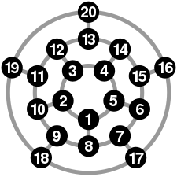

```{r setup, include=FALSE}
knitr::opts_chunk$set(echo = TRUE)
```

Hunt the Wumpus is a text-based game originally developed in 1973 by a man named Gregory Yob. The goal is basically to navigate through a cave system with a total of 20 caves in a shape similar to a dodecahedron, where each cave is connected to 3 others, and kill the wumpus. However, the game is entirely text-based meaning that the player operates only on what it can hear or smell and must avoid dangers like bats which drop the player in a random cave and pits, which immediately kill the player if the player falls into one. The Wumpus is not affected by bats or caves and if the you end up walking into the same cave as the wumpus, you die. You have 5 arrows which you can use to shoot the Wumpus but if you miss, the Wumpus flees to another cave. 


# What is different in my version?
Some minor differences in mine are that you don't have a limited number of arrows and that when you shoot arrows, you 'hear' additional clues about the nearby caves. Originally, you only had 5 arrows and could possibly find more in other caves. I made it so that instead of having a limited number, you have infinite arrows. In addition, there are some subtle hints as to what caves have pits and bats. If you shoot an arrow into a cave with a pit, you can hear it clatter down a pit and if you shoot into a cave with bats, you can hear them screech. Granted, this allows players to repeatedly shoot arrows into all caves and build their own map and make the game easy but my hope was just to make the game a little less difficult while still maintaining the same idea, to hunt down and kill the Wumpus. 

# What does the map look like? 
Below is a map of how the caves are organized in Hunt the Wumpus. 
```{r, echo=FALSE, out.width='75%', fig.align='center'}

```
(Image used from [wikipedia](https://en.wikipedia.org/wiki/Hunt_the_Wumpus#/media/File:Hunt_the_Wumpus_map.svg))

Not only is this map unique because it isn't in a grid, but it also has a sort of "concentric" design allowing each node (or cave) to be connected to exactly three others. 


# My Version of Hunt The Wumpus

If you die and want to play again, I believe that there is a built-in function that asks you to play again. However, if you say you don't but decide that you in fact do want to play again, click the small "run" button to start the program again. To see the code for the version of the game embedded below, click [here](https://github.com/ThunderingWest4/thunderingwest4.github.io/tree/master/code_for_huntthewumpus). For the original code I wrote for Hunt the Wumpus, click [here](https://github.com/ThunderingWest4/HuntTheWumpus). I believe that the original code has a downloadable .exe file (for Windows) if you wish to run it on your computer. 
```{r, echo=FALSE}
htmltools::includeHTML("assets/huntthewumpus/htwcode.html")
```
