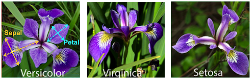
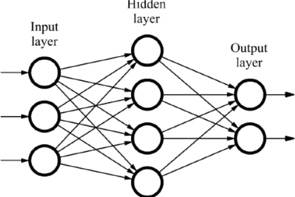

```{r, echo=FALSE, include=FALSE}
library("htmltools")
```
# What is the Iris Flower Dataset?

The Iris Flower Dataset, also known as Fisher's Iris set, was introduced by a British scientist named Ronald Fisher in 1936. The Dataset has 50 different samples from each of three different types of flowers - Iris Setosa, Iris Virginica, and Iris Versicolor. Each sample has the sepal length, sepal width, petal length, and petal width of the flower. 

```{r, echo=FALSE, out.width='100%', fig.align='center'}

```

This dataset can have many uses within data analysis and I decided, as one of my first experiments with Neural Networks and Machine Learning, to build a Neural Network capable of classifying the three different species all the way from the ground up. This meant I wasn't allowed to use any libraries like Numpy or Tensorflow or Keras, even for Linear Algebra resulting in a lot of custom functions designed to calculate the sigmoid, sigmoid derivative, and dot product of lists and numbers. The Network has one input layer with 4 nodes, one hidden layer with 5 nodes, and one output layer with 3 nodes and used the Sigmoid function for the activation of nodes. It took a while to get working, and even now the backpropogation isn't fully working (only the hidden to output layer weights are being modified) but the network ended up with a relatively high accuracy rate on the test dataset. 

The sigmoid function is one of the functions seen most commonly in classifier programs which gives a value between 0 and 1. The equation for the sigmoid function is 1 / (1 + $e^{-x}$) where e represents the natural growth rate, also known as Euler's number, 2.71828.


```{r, echo=FALSE, out.width='50%', fig.align='center'}
knitr::include_graphics('assets/irisflower/sigmoid_curve.png')
htmltools::includeHTML("assets/irisflower/sigmoidimg.html")
```


One of the main reasons that the sigmoid is used is because it's only between 0 and 1, making it extremely useful for probability and classification problems. For example, in this network, the program is just calculating the probability of certain inputs corresponding to a specific flower and the output node with the highest value is the network saying that the flower has the highest probability of being that type/breed. 

# Summary of a Neural Network
A Neural Network is a program designed to mimic how the human brain works. Just think about the process of when you see and identify something - the input layer, or your eyes, takes the information and passes it to the hidden layer, or your brain, which then processes the information and passes the result to the output layer, which is what you identify it as. All the different layers of a Neural Network have "nodes", which are similar to small cells designed to carry information and each node is connected to all the nodes in the next layer. 
Neural Networks generally use two different subsections of the overall dataset: 
+ A training set, which is used (as in its name describes) for training the network
+ A testing set, which is used to test the accuracy of the network after it was trained
The Iris Flower dataset has 150 total examples so initially, I used 125 examples for training and 25 to test but later, to get a better idea of the Network's accuracy over a larger testing set, I used 100 examples for training and 50 for testing which is also what the network is trained/tested on in the embedded code below. 

```{r echo=FALSE, out.width='75%', fig.align='center'}

```

# The Network Itself

Now that we've briefly gone over what a neural network is and what its dataset is, we can experiment with it! You'll be able to adjust the learning rate of the network as well as the number of iterations for which it trains and in turn see how that affects its accuracy.
The console will show the past simulations that you've run to allow you to maximize accuracy based on iterations and learning rates. However, even if you use the exact same iterations and learning rate on two different simulations, it's incredibly improbable that they will have the same accuracy because the weights (connections between nodes) are randomly generated each time the program is run and then changed from there based on the backpropogation and error calculations. 

## From Scratch

There are a couple small issues with the packages I'm using to upload the dataset which are sadly unavoidable although I've tried fiddling around. If when running the code, a red box talking about the deprecation of imp and a transition to importlib pops up in the console, just hit the run button next to the trinket icon at the top of the embedded code box. 
Also, if you hit "no" to run another simulation but decided that you do, in fact, want to run another simulation, just hit the "run" button at the top of the embedded code box. The "run" button simply runs the program again allowing you to run more simulations. 

Sandbox for the Network: 
```{r, echo=FALSE}
htmltools::includeHTML("assets/irisflower/neuralnetworkembed.html")
```

## Tensorflow Network

After building my own network from scratch, I decided to build one using Tensorflow to see the difference. Not only was the code several hundred lines shorter, but it was also more accurate than mine. 

(code will eventually be embedded here)

## Additional Notes: 

To see the code that I've used and embedded in the network sandboxes, check out my github repository for the website [here](https://github.com/ThunderingWest4/thunderingwest4.github.io) which has all the code I've written and compiled currently running on this site. For the code specifically used and embedded, click [here](https://github.com/ThunderingWest4/thunderingwest4.github.io/tree/master/Code_for_iris_flower_nn/). There are two separate folders - one for my custom network, the one I built from scratch, and another for the one built using tensorflow. 

